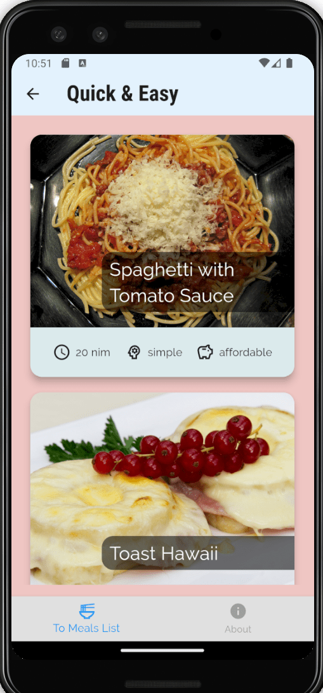
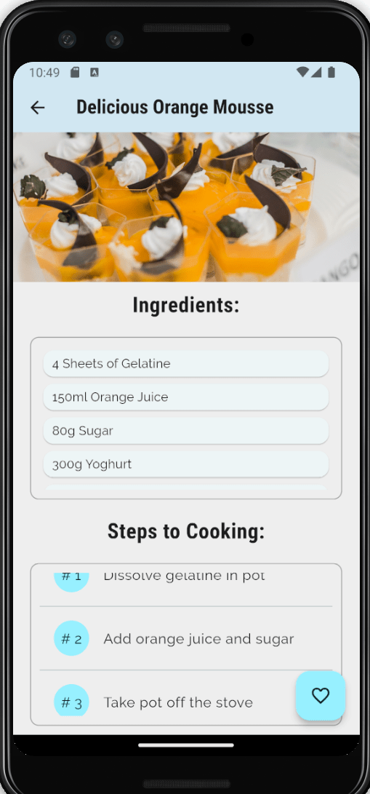
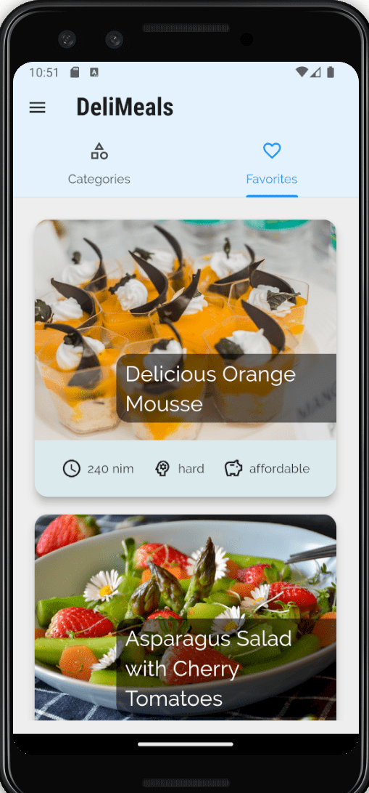
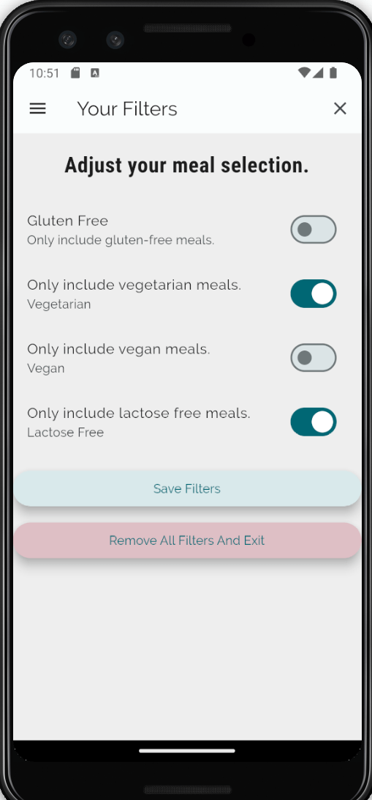

# Book of recipes.

> A recipe book with favorites and filters on Flutter.

---

[Description](#description) •
[Project setup](#project-setup) •
[Features](#features) •
[How To Use](#how-to-use) •
[Project Status](#project-status) •
[Room for Improvement](#room-for-improvement) •
[License](#license) •
[Contact](#contact)

## Description

Recipe book divided into categories. Recipes have detailed descriptions, ingredients list and steeps to cocking list.
Contains filters and a favorites tab.

## Project setup

- Clone this repo to your desktop.
- May be needed run `flutter packages get` or click Get packages button in IDE to install all the dependencies.
- Launch the emulator or connect your smartphone.
- Run the application in your IDE (Run -> Run Without Debugging for VSCODE).
- Enjoy.

## Features

- Recipe book in Flutter.
- Meals have descriptions and ingredients list and steeps to cocking.
- Favorites tab.
- Gluten free, vegetarians, lactose and other filters.

## How To Use

![tutorial][tutorial]

## Project Status

Project is: _completed_

## Room for Improvement

To do:

- [ ] Implement welcome screen.

Improvement:

- [ ] Implement display graphic level result.
- [ ] Add animation.
- [ ] Add i18next.
- [ ] Implement toggle day-night.

## License

This project is open source and available under the [MIT](../LICENSE).

## Contact

Created by [@RimidalU](https://www.linkedin.com/in/uladzimir-stankevich/) - feel free to contact me!

<!-- MARKDOWN LINKS & IMAGES -->

[tutorial]: ./assets/demo.webp
